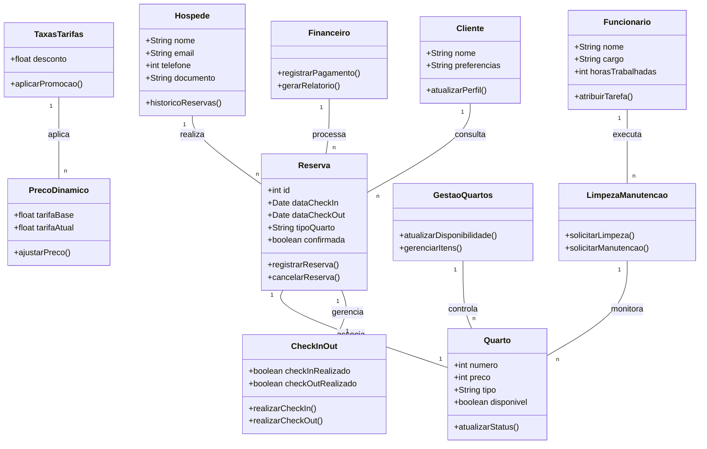

---

# **Dicionário de Dados**

| Entidade | Atributo | Tipo | Descrição |
|----------|---------|------|-----------|
| Hospede | nome | String | Nome do hóspede |
| Hospede | cpf | String | CPF do hóspede |
| Hospede | telefone | int | Telefone do hóspede |
| Hospede | email | String | E-mail do hóspede |
| Reserva | idReserva | int | Identificador único da reserva |
| Reserva | dataCheckin | Date | Data de entrada no hotel |
| Reserva | dataCheckout | Date | Data de saída do hotel |
| Reserva | status | String | Status da reserva (confirmada/cancelada) |
| Quarto | numero | int | Número do quarto |
| Quarto | tipo | String | Tipo de quarto (luxo, standard, etc.) |
| Quarto | disponivel | boolean | Disponibilidade do quarto |
| Quarto | preco | float | Preço do quarto |
| Funcionario | nome | String | Nome do funcionário |
| Funcionario | cargo | String | Cargo do funcionário |
| Funcionario | cpf | String | CPF do funcionário |
| Funcionario | telefone | String | Telefone do funcionário |
| Pagamento | idPagamento | int | Identificador único do pagamento |
| Pagamento | valor | float | Valor do pagamento |
| Pagamento | metodo | String | Método de pagamento (cartão, boleto, etc.) |
| Pagamento | dataPagamento | Date | Data do pagamento |
| PrecosDinamicos | precoBase | float | Preço base do quarto |
| PrecosDinamicos | precoAjustado | float | Preço ajustado conforme demanda |
| CheckinCheckout | idCheckin | int | Identificador do check-in/check-out |
| CheckinCheckout | dataCheckin | Date | Data do check-in |
| CheckinCheckout | dataCheckout | Date | Data do check-out |
